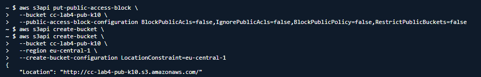
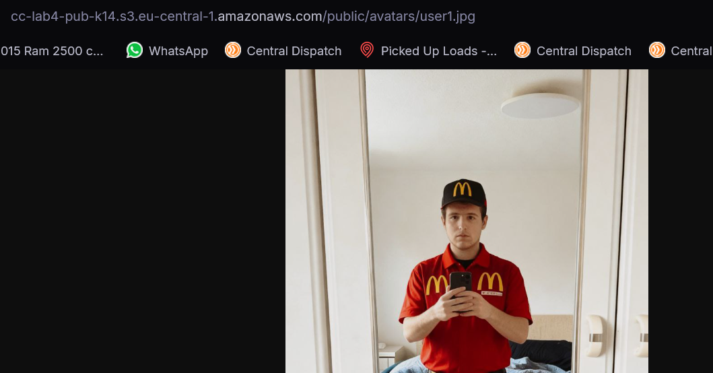
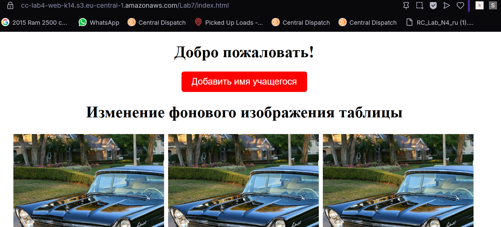

# Лабораторная работа №4

## Облачное хранилище данных Amazon S3

**Студент: №14**

------------------------------------------------------------------------

## Цель работы

Познакомиться с сервисом Amazon S3 и выполнить основные операции: -
создание публичного и приватного бакетов; - загрузка объектов через
консоль и CLI; - включение версионирования; - настройка
Lifecycle-правил; - развертывание статического веб-сайта на S3.

------------------------------------------------------------------------

## Шаг 1. Подготовка локальных файлов

Создана структура:

    s3-lab/
    ├── public/
    │   ├── avatars/
    │   │   ├── user1.jpg
    │   │   └── user2.jpg
    │   └── content/logo.png
    ├── private/
    │   └── logs/activity.csv
    └── README.md

------------------------------------------------------------------------

## Шаг 2. Создание бакетов

Созданы бакеты: - `cc-lab4-pub-k14` --- публичный - `cc-lab4-priv-k14`
--- приватный\
Регион: **eu-central-1**

Публичный бакет создан с: - ACLs enabled\
- Block all public access --- выключено

Приватный --- все параметры по умолчанию.

**Скрин создания бакета:**\

**Ответ:**\
Опция *Block all public access* запрещает любые публичные политики и
ACL, защищая бакет от случайной утечки данных.

------------------------------------------------------------------------

## Шаг 3. Загрузка объектов через AWS Console

Загружены: - `avatars/user1.jpg` --- публичный - `content/logo.png` ---
публичный

Для объекта `user1.jpg` вручную выдан доступ **public-read**.

**Ответ:**\
Ключ объекта (Object Key) --- полный путь (`avatars/user1.jpg`),\
Имя файла --- только `user1.jpg`.

------------------------------------------------------------------------

## Шаг 4. Загрузка объектов через AWS CLI

Выполнены команды:

    aws s3 cp s3-lab/public/avatars/user2.jpg s3://cc-lab4-pub-k14/avatars/user2.jpg --acl public-read
    aws s3 cp s3-lab/public/content/logo.png s3://cc-lab4-pub-k14/content/logo.png --acl public-read
    aws s3 cp s3-lab/private/logs/activity.csv s3://cc-lab4-priv-k14/logs/activity.csv

**Разница команд:** - `cp` --- копирование файла - `mv` --- копирование
с удалением исходного - `sync` --- синхронизация каталогов

`--acl public-read` --- делает объект публично доступным.

------------------------------------------------------------------------

## Шаг 5. Проверка доступа

Проверены URL-адреса публичных объектов, изображение успешно
отображается.

Приватный объект недоступен.

**Скрин проверки доступа:**\

------------------------------------------------------------------------

## Шаг 6. Версионирование объектов

Включено Versioning → Upload обновлённого `logo.png` → создана новая
версия.

**Ответ:**\
После отключения версии объектов **сохраняются**, но новые версии
создаваться не будут.

------------------------------------------------------------------------

## Шаг 7. Lifecycle-правила (приватный бакет)

Создано правило:

-   Standard-IA через 30 дней\
-   Glacier Deep Archive через 365 дней\
-   Удаление через 1825 дней

**Ответ:**\
Storage Class --- это класс хранения данных (дорогие/дешевые,
быстрые/архивные). Позволяет экономить деньги при длительном хранении.

------------------------------------------------------------------------

## Шаг 8. Статический веб-сайт на Amazon S3

Создан бакет: `cc-lab4-web-k14`\
Включено **Static website hosting**.\
Загружен сайт, назначены публичные ACL.

Открыт URL вида:

    https://cc-lab4-web-k14.s3.eu-central-1.amazonaws.com/Lab7/index.html

**Скрин работы сайта:**\

------------------------------------------------------------------------

## Вывод

В ходе выполнения лабораторной работы были изучены основные возможности
Amazon S3: - управление доступом (ACL),\
- загрузка объектов через Console и CLI,\
- настройка версии объектов,\
- автоматизация хранения через Lifecycle,\
- развертывание статических веб-сайтов.

Получены практические навыки работы с объектным хранилищем AWS.

------------------------------------------------------------------------
